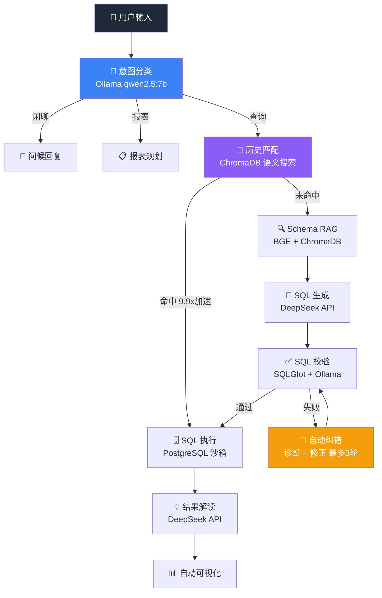
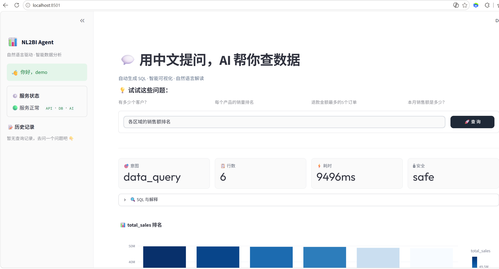
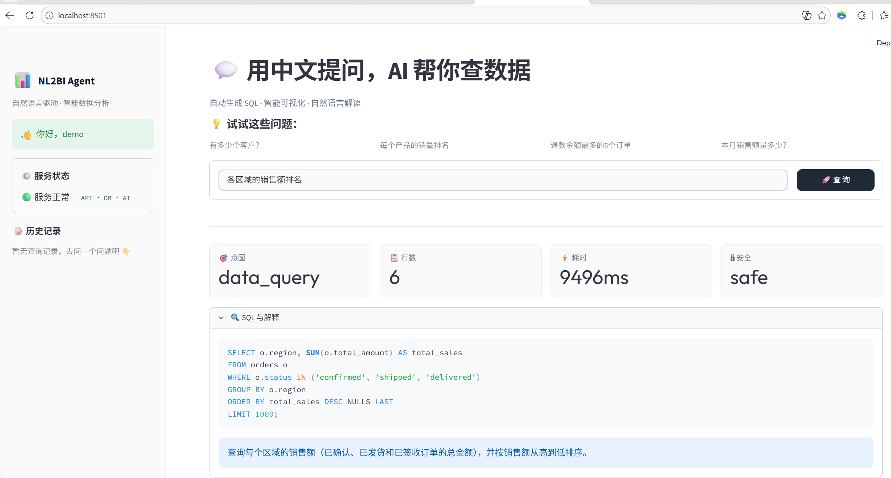
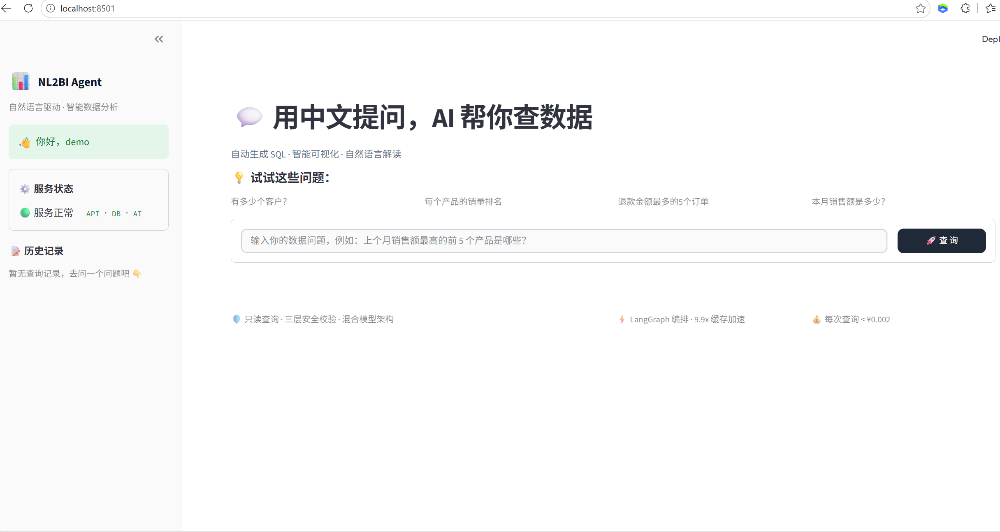

# 📊 NL2BI Agent — 自然语言数据分析 Agent

[](https://python.org)
[](https://github.com/HBH0713/nl2bi-agent/actions)
[](https://langchain.com/langgraph)
[](LICENSE)
[](https://docs.docker.com/compose/)

**用中文提问，AI 自动查数据库、画图、出报告。**

基于 LangGraph 状态机 + 混合模型（本地 Ollama + 云端 DeepSeek）架构，实现从自然语言到 SQL 生成、安全校验、自动纠错、结果解读的完整链路。

---

## ✨ 核心特性

| 特性 | 说明 |
|------|------|
| 🔄 **Agent 编排** | LangGraph 状态机，支持循环、分支、条件路由 |
| 🧠 **混合模型** | 本地 Ollama(qwen2.5:7b) 做意图分类 + 语义验证，云端 DeepSeek 做 SQL 生成 |
| 🔍 **Schema RAG** | BGE 中文嵌入 + ChromaDB 向量检索，自动匹配相关表结构 |
| 🛡️ **三层安全** | SQLGlot 语法 → 安全规则引擎 → Ollama 语义校验 |
| 🔧 **自动纠错** | SQL 校验失败→诊断错误→修正→最多 3 轮（参照 WrenAI 设计） |
| ⚡ **语义缓存** | 相似问题命中历史后 **9.9 倍** 加速，跳过 SQL 生成和解释 |
| 📊 **智能可视化** | 自动识别数据类型，推荐并生成图表（柱状/饼图/折线） |
| 🔒 **数据脱敏** | 自动检测并遮蔽敏感字段（姓名/手机/邮箱） |
| 🐳 **一键部署** | `docker compose up -d` 启动全部服务 |

## 🏗 架构



## 📸 效果展示

| 图表查询 | SQL 解读 | 数据概览 |
|------|------|------|
|  |  |  |

## 🚀 快速开始

### 前置要求

- **Docker & Docker Compose**（推荐）或 Python 3.11+
- **DeepSeek API Key**（[免费注册](https://platform.deepseek.com)）
- 4GB+ 可用内存

### 方式一：Docker 一键部署（推荐）

```bash
# 1. 克隆项目
git clone https://github.com/yourname/nl2bi-agent.git
cd nl2bi-agent

# 2. 配置 API Key
cp .env.example .env
# 编辑 .env → 填入 DEEPSEEK_API_KEY

# 3. 一键启动（含 PostgreSQL + Ollama + ChromaDB + API + UI）
docker compose up -d

# 4. 拉取本地模型（仅首次）
docker exec nl2bi-ollama ollama pull qwen2.5:7b

# 5. 打开浏览器
# API 文档: http://localhost:8000/docs
# Web UI:  http://localhost:8501
```

### 方式二：本地开发

```bash
# 1. 安装依赖
pip install -e ".[dev]"

# 2. 初始化（建库 + 造数据 + 索引）
bash scripts/init_db.sh

# 3. 启动
uvicorn src.main:app --reload --port 8000 &    # API
streamlit run src/app.py --server.port 8501 &   # UI
```

### 国内用户注意

如果 `docker compose pull` 失败，需先配置 Docker 代理：
> Docker Desktop → Settings → Resources → Proxies → 填入代理地址 → Apply & Restart

或使用轻量部署（仅容器化 API，复用本地 PostgreSQL/Ollama）：
```bash
docker compose -f docker-compose.lite.yml up -d
```

## 📁 项目结构

```
nl2bi-agent/
├── src/
│   ├── agents/              # LangGraph Agent 节点
│   │   ├── graph.py         #   - 状态机构建 + 路由
│   │   ├── intent.py        #   - 意图分类 (Ollama)
│   │   ├── schema_rag.py    #   - Schema 检索
│   │   ├── sql_generator.py #   - SQL 生成 (DeepSeek)
│   │   ├── sql_validator.py #   - 三层校验 (语法+安全+语义)
│   │   ├── sql_corrector.py #   - 自动纠错循环 (最多3轮)
│   │   ├── interpreter.py   #   - 结果解读 + 图表推荐
│   │   ├── report_planner.py#   - 报表规划
│   │   └── report_runner.py #   - 报表执行
│   ├── models/              # 模型抽象层
│   │   ├── ollama.py        #   - Ollama 本地模型客户端
│   │   ├── openai_compat.py #   - DeepSeek/OpenAI 客户端
│   │   └── router.py        #   - 混合模型路由 + 降级
│   ├── db/                  # 数据层
│   │   ├── connection.py    #   - PostgreSQL 连接池
│   │   ├── executor.py      #   - SQL 沙箱执行
│   │   └── chroma_client.py #   - ChromaDB 客户端
│   ├── rag/                 # RAG 模块
│   │   ├── embedder.py      #   - BGE 中文嵌入
│   │   ├── retriever.py     #   - 混合检索
│   │   ├── schema_indexer.py#   - Schema 索引构建
│   │   └── query_history.py #   - 历史匹配 + 语义缓存
│   ├── api/                 # FastAPI 层
│   │   ├── routes/          #   - 路由 (query/health/auth)
│   │   ├── auth.py          #   - 认证
│   │   ├── middleware.py     #   - 请求日志
│   │   └── schemas.py       #   - Pydantic 模型
│   ├── prompts/             # Prompt 模板
│   │   ├── sql_gen.py       #   - SQL 生成提示词
│   │   └── interpreter.py   #   - 结果解读提示词
│   ├── utils/               # 工具层
│   │   ├── sql_parser.py    #   - SQL 校验 + 安全规则
│   │   ├── data_masker.py   #   - 敏感数据脱敏
│   │   ├── json_parser.py   #   - LLM JSON 解析
│   │   ├── retry.py         #   - 指数退避重试
│   │   └── logger.py        #   - JSON 结构化日志
│   ├── app.py               # Streamlit Web UI
│   ├── main.py              # FastAPI 入口
│   └── config.py            # 全局配置
├── data/                    # 示例数据 + Schema
├── scripts/                 # 初始化脚本
├── tests/                   # 测试
├── docker-compose.yml       # 全栈部署
├── docker-compose.lite.yml  # 轻量部署
├── Dockerfile               # 应用镜像
└── .env.example             # 环境变量模板
```

## ⚡ 性能数据

| 场景 | 耗时 | 说明 |
|------|------|------|
| 首次查询 | ~7s | 完整链路：意图+Schema+SQL+校验+执行+解读 |
| 语义缓存命中 | **~0.7s** | 相似问题直接复用（**9.9x** 加速） |
| SQL 自动纠错 | +3-5s/轮 | 最多 3 轮，多数错误 1 轮修正 |

## 🛡 安全机制

| 层级 | 方法 | 拦截内容 |
|------|------|---------|
| L1 语法 | SQLGlot AST 解析 | 语法错误、不合规 SQL |
| L2 规则 | 关键字/函数黑白名单 + 深度限制 | DELETE/DROP/INSERT、深层子查询 |
| L3 语义 | Ollama 逻辑审查 | 表名错误、遗漏 JOIN、不合理聚合 |
| DB 沙箱 | 只读事务 + 超时 + 行数限制 | 数据泄露、慢查询 |
| 脱敏 | 敏感字段自动检测 + 遮蔽 | 姓名/手机/邮箱/身份证 |

## 🧪 测试

```bash
# 单元测试（无需外部服务）
pytest tests/unit/ -v

# 覆盖率报告
pytest tests/ -v --cov=src --cov-report=html
```

## 📊 技术栈

| 层 | 技术 |
|------|------|
| Agent 编排 | LangGraph (StateGraph + MemorySaver) |
| LLM (精度) | DeepSeek-chat / GPT-4o |
| LLM (轻量) | Ollama + Qwen2.5-7B |
| 向量嵌入 | BAAI/bge-small-zh-v1.5 (512d) |
| 向量数据库 | ChromaDB |
| 关系数据库 | PostgreSQL 16 + pgvector |
| SQL 解析 | SQLGlot |
| API 框架 | FastAPI + Pydantic v2 |
| 前端 | Streamlit + Plotly |
| 日志 | structlog (JSON) |
| 部署 | Docker Compose |

## 📝 License

MIT
