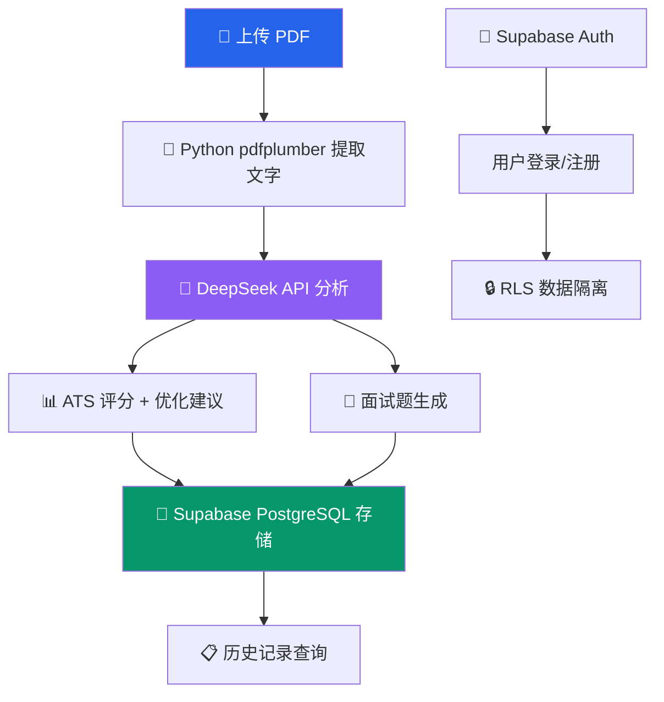

# 📄 ResumeAI — AI 简历分析与面试题生成平台

[](https://nextjs.org)
[](https://typescriptlang.org)
[](https://supabase.com)
[](https://docker.com)

**上传简历 PDF → AI 评分 → 优化建议 → JD 匹配 → 面试题生成**

## ✨ 功能

| 功能 | 说明 |
|------|------|
| 📄 PDF 简历解析 | 上传中文 PDF → Python pdfplumber 提取文字 |
| 📊 ATS 评分 | DeepSeek AI 分析简历质量，0-100 评分 |
| 💡 智能优化 | 逐段分析，给出原版 vs 优化版对比 |
| 🎯 JD 匹配 | 粘贴职位描述 → AI 对比简历 → 匹配度 + 差距分析 |
| 💬 面试题生成 | 根据简历内容 + JD 自动生成针对性面试题 |
| 🔐 用户系统 | Supabase Auth（邮箱注册/登录） |
| 📋 历史记录 | 所有分析记录自动保存，追踪改进历程 |
| 🐳 Docker | 一键部署 |

## 🏗 架构



## 🚀 快速开始

```bash
git clone https://github.com/HBH0713/resume-ai.git
cd resume-ai
cp .env.local.example .env.local  # 填入 DEEPSEEK_API_KEY + Supabase 配置
npm install
npm run dev                        # http://localhost:3000
```

## 🛠 技术栈

| 层 | 技术 |
|------|------|
| 前端 | Next.js 15 · React 19 · TypeScript · Tailwind CSS |
| UI 组件 | Shadcn UI · Lucide Icons |
| 后端 API | Next.js API Routes |
| AI | DeepSeek API |
| 认证 | Supabase Auth |
| 数据库 | Supabase PostgreSQL + RLS |
| PDF 解析 | Python pdfplumber (FastAPI 微服务) |
| 部署 | Vercel · Docker |

## 📁 项目结构

```
src/
├── app/
│   ├── api/analyze/    # AI 简历分析 API
│   ├── api/match/      # JD 匹配 API
│   ├── dashboard/      # 概览页
│   ├── analyze/        # 上传分析页
│   ├── results/        # 分析结果页
│   ├── interview/      # 面试题库
│   ├── history/        # 历史记录
│   └── login/          # 登录页
├── components/
│   ├── ui/             # Shadcn UI 组件
│   └── Sidebar.tsx     # 侧边栏导航
├── lib/
│   ├── supabase/       # Supabase 客户端
│   ├── db.ts           # 数据库操作
│   └── utils.ts        # 工具函数
└── middleware.ts       # Auth 鉴权中间件
```

## License

MIT
